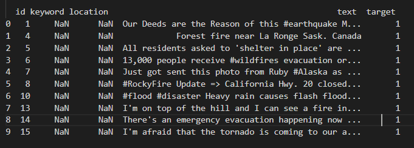
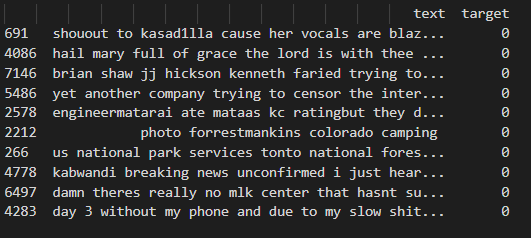

# DisasterTweets
Deep Learning models to identify whether tweets contain real disasters or not.

# Preprocessing
Data format before preprocessing:

Steps for preprocessing:
1. removed id, keyword, and location columns
2. removed URLs from text
3. made all the text lowercase
4. removed emojis, punctuation, symbols

Processed data looks like this:

## Split into training and testing texts, and training and testing labels.
- X_train (4906,) of training text (contains a string of processed text)
- Y_train (4906,) of training labels (either 0, not disaster or 1, disaster)
- X_test (1636,) of testing text (contains a string of processed text)
- Y_test (1636,) of testing labels (either 0, not disaster or 1, disaster)

For LSTM Model, I also tokenized the inputs in the main function if you decide you need them.

## LSTM MODEL

## BERT MODEL

## RESULTS
On an NVIDIA GeForce RTX 2070 GPU, the LSTM model takes about 45 seconds to run. The BERT model takes about 7 minutes to run.

The LSTM model achieves a testing accuracy of about 75%.
It achieves a training accuracy of __%.

The BERT model achieves a testing accuracy of about 82%.
It achieves a training accuracy of 80%.

